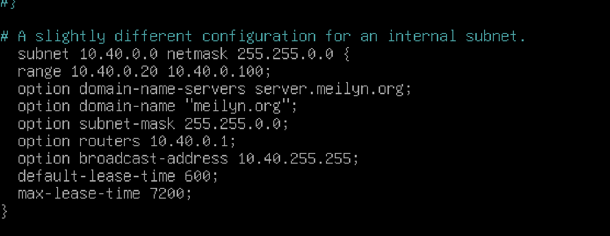
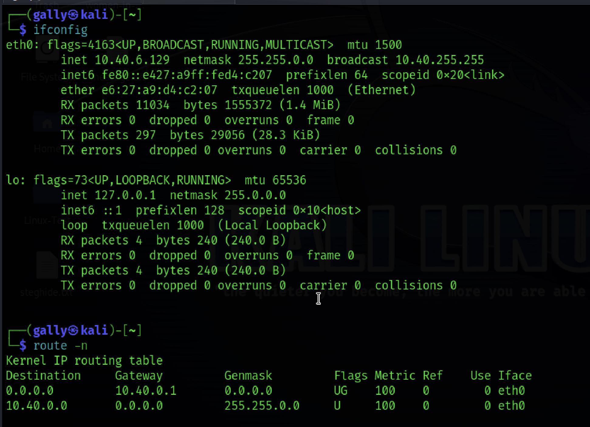
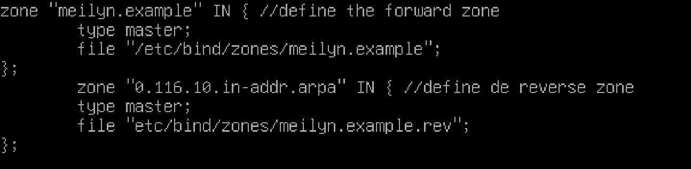

## Setup Debian Server


- I created a new user account with regular account privileges.  
	
		sudo useradd g***
		sudo passwd ****
		
- I upgraded the current packages of the Debian system. Because It may be the server is built with the old image file. The Debian team keeps working to enhance server security and provide updated packages regularly.	
	
		sudo apt upgrade 	
		
- I configured System’s Hostname identity for computer networks. It helps users and network machine to easily recognize a machine within a network in a human-readable format.
 
		hostnamectl 
		sudo hostnamectl set-hostname debianServer
		
- By default, Debian doesn’t have a firewall installed so I installed one 
	
		apt update
		apt install ufw
		
- Once installed I enabled my firewall. 

		sudo ufw enable
		
- I set default policies:
	
		sudo ufw default deny incoming
		sudo ufw default allow outgoing	
		
- I reload the firewall UFW:

		sudo ufw reload
		
- Allow ssh connections and enable the firewall:

		ufw allow SSH		
		
- Verify the status with:

		ufw status verbose		
		
- Enable the firewall:

		ufw enable
		
_Note: later you will probably need to adjust the firewall settings to allow traffic in from other services that you install; example for Nginx: `sudo ufw allow 'Nginx Full'`._

You can now close the connection to the server with `exit`.****

## 3. Harden SSH

### 3.1 Client config

On your local machine, open the `ssh_config` file:

`sudo nano /etc/ssh/ssh_config`

Add or modify these lines to allow public key authentication, disable IPv6 to reduce attack surface, and use the strongest cipher suites, message integrity codes, and key exchange algorithms available:

```
PubkeyAuthentication yes
AddressFamily inet
StrictHostKeyChecking ask
Ciphers chacha20-poly1305@openssh.com
MACs hmac-sha2-512-etm@openssh.com
KexAlgorithms curve25519-sha256
```

### 3.2 Server config

Open two terminal tabs/windows and establish two separate SSH connections to the server, for backup purposes:

`ssh root@server_ip`

Restart the sshd daemon:

`systemctl restart sshd`

If both connections are still alive, try opening a third terminal window and test new connections:

`ssh root@server_ip`

Proceed if everything is working as expected.

In any terminal, make a backup of the original SSH configuration file with:

`cp /etc/ssh/sshd_config /etc/ssh/sshd_config_backup`

Now open the `sshd_config` file:

`nano /etc/ssh/sshd_config`

Add or modify these lines to enable SSH v2 for added protections against known vulnerabilities, disable IPv6, disallow root/pass logins, only allow logins from the user `newuser`, and use the strongest ciphers and algos available:


```
Protocol 2
AddressFamily inet
PermitRootLogin prohibit-password
PasswordAuthentication no
AllowUsers newuser
Ciphers chacha20-poly1305@openssh.com
MACs hmac-sha2-512-etm@openssh.com
KexAlgorithms curve25519-sha256
```

_Note: replace `newuser` with the actual username from step 1._

_Note: run `ssh -Q cipher`, `ssh -Q mac`, and `ssh -Q kex` for a list of supported ciphers and algorithms._

You can also change the default ssh daemon listen port from 22 to something else in an attempt to avoid open ports scans:

`Port 3489`

_Note: if you change the default ssh port, you need to update ufw rules; example: `ufw allow 3489`. Connect with `ssh newuser@server_ip -p 3489`._

Save the file with `CTRL+X` > `Y` > press Enter.

### 3.2 Test connection

Restart the sshd daemon:

`systemctl restart sshd`

Open another terminal tab/window and try to SSH to the server:

`ssh newuser@server_ip`

If it doesn’t work, check for configuration errors using the other terminal and then try again.

If successful, you will be able to ssh with `newuser` to the server from now on, and install any software you want.

# Installing DHCP SERVER

I followed this tutorial : [How to install DHCP Server] (https://www.youtube.com/watch?v=1csFmQeXHlg)

	sudo apt install -y isc-dhcp-server

### /etc/default/isc-dhcp-server

Add configuration for DHCPDv4. INTERFACESv4 is a network interface name which is connected to a network which you try to provided DHCP. 
		
		sudo nano etc/default/isc-dhcp-server 
		
		INTERFACESv4=enp0S1
		
### /etc/dhcp/dhcpd.conf 

	sudo nano /etc/dhcp/dhcpd.conf 
	
###	A sligthly different configuration for an internal subnet
using [IP Calculator](https://www.calculator.net/ip-subnet-calculator.html?cclass=any&csubnet=16&cip=10.40.6.125&ctype=ipv4&printit=0&x=34&y=22) I calculated the next settings. 



	sudo systemctl restart isc-dhcp-server
	
			
### Netstat

Verification the network with netstat to check the port udp is listening on port : 67 

	sudo netstat -anp | grep dhcp

### Firewall 
- I added port 67 on my firewall 

		sudo ufw allow 67/udp

- check status

		sudo ufw status
		
### Kali Machine
	ifconfig
	route -n 
	
 

Everything is working! (yay) 

Printed  active DHCP leases.

	sudo dhcp-lease-list	


# DNS

### Installing BIND9

BIND (Berkeley Internet Name Domain) is an implementation of the DNS protocol. In BIND 9, several number of major enhancements have been made, including IPv6 support, much more flexible configuration and control, improved caching performance, EDNS0 support for larger UDP responses, and better management over dynamically assigned IP addresses. 	

	sudo apt install bind9 bind9utils bind9-doc
	
The **bind9utils** are utilities for managing BIND configuration and are named the command used to control BIND from the command line.

**Note:** bind9-doc is a documentation package for BIND software.

Check it out bind status 	

	sudo systemctl status bind9

Checked out the BIND SERVERS LISTENS 

	sudo netstat -lnptu | grep named
	
### Configuring BIND9

By default, BIND is configured to serve the localhost only. This means that any request that comes from outside your server will be rejected by BIND itself unless you have it properly configured.

First, I set the DNS server to listen to all IP addresses to send requests to the DNS server from various places: From the server, from a different network, or when you are using the Internet.	

	cd /etc/bind

	sudo nano named.conf.options

	Let's replace listen-on {127.0.0.1;};

	by

	listen-on {any;};

	listen-on-v6 { any; }
	
	##exit
	
	sudo service bind9 restart
	sudo service bind9 status
	
	
### Creating Forward Lookup Zones 

They map a domain name to an IP address and are used in resolving domain names to IP addresses for email, web pages, etc.

I edited the “/etc/bind/named.conf.options” file to declare a forward zone.
with the following code 

### named-checkconf /etc/bind/named.conf.options

	// allow only LAN traffic from 10.40.0.0-10.40.0.30
	acl LAN {
		10.40.0.0/16;
	};
	options {
        directory "/var/cache/bind"; // default directory
        allow-query { localhost; LAN; }; // allow queries from localhost and 			10.40.0.0-10.40.0.30
        forwarders { 1.1.1.1; }; // use CloudFlare 1.1.1.1 DNS as a forwarder
        recursion yes;  // allow recursive queries
	};
	
check the syntax of the file with : 

	sudo named-checkconf named.conf.options
	
### Edit the named.conf.local file

The named.conf.local is typically used to define local DNS zones for a private domain. We will update this file to include our forward and reverse DNS zones.


		
Check the syntax 

	sudo named-checkconf /etc/bind/named.conf.options
	
### Create a directory for your zone files

Create a directory to store the zone files we specified in the previous step.

	sudo mkdir /etc/bind/zones
	
### Create the forward zone file

	cp /etc/bind/db.local /etc/bind/zones/meilyn.org	
open 

	sudo nano meilyn.org
	
--	
	

	$TTL    604800
	; SOA record with MNAME and RNAME updated
	@       IN      SOA     meilyn.org. root.meilyn.org. (
                              3         ; Serial Note: increment after each change
                         604800         ; Refresh
                          86400         ; Retry
                        2419200         ; Expire
                         604800 )       ; Negative Cache TTL
	; Name server record 
	@       IN      NS      bindserver.meilyn.org.
	; A record for name server
	bindserver      IN      A       10.40.6.125
	; A record for clients
	client1      IN      A       10.40.0.3
	client2      IN      A       10.40.0.4 


check the configuration:

	named-checkzone meilyn.org /etc/bind/zones/meilyn.org
	
### Create the reverse zone file

Now, we'll create a corresponding reverse zone file /etc/bind/zones/meilyn.org.rev. The reverse zone file allows the Bind DNS server to resolve IP addresses (like 10.40.6.3) to names (like bindserver.meilyn.org).

First, copy the default db.local zone file to /etc/bind/zones/meilyn.org.rev

	$TTL    604800
	; SOA record with MNAME and RNAME updated
	@       IN      SOA     meilyn.org. root.meilyn.org. (
	                              2         ; Serial Note: increment after each change
	                         604800         ; Refresh
	                          86400         ; Retry
	                        2419200         ; Expire
	                         604800 )       ; Negative Cache TTL
	; Name server record 
	@       IN      NS      bindserver.meilyn.org.
	; A record for name server
	bindserver      IN      A       10.40.6.125
	; PTR record for name server
	2   IN      PTR     bindserver.meilyn.org
	; PTR record for clients
	3   IN      PTR     client1.meilyn.org
	4   IN      PTR     client2.meilyn.org
	
Once the changes are complete, use the named-checkzone command to check the configuration:

	sudo named-checkzone meilyn.org /etc/bind/zones/meilyn.org.rev
	
Restart BIND 9

	sudo systemctl restart bind9
		
	
###	 Configure clients to use the configuration

Once my Private Bind DNS server is configured, I can configure the clients to use it. 

First, check which interface is used for LAN connectivity

	ip -brief addr show to 10.40.0.0/16
	
	R= enp0s1   UP  10.40.6.125/16


	
	
	
	

		
		 
		

		
		