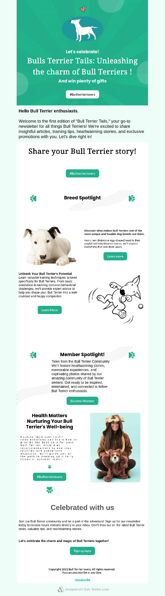
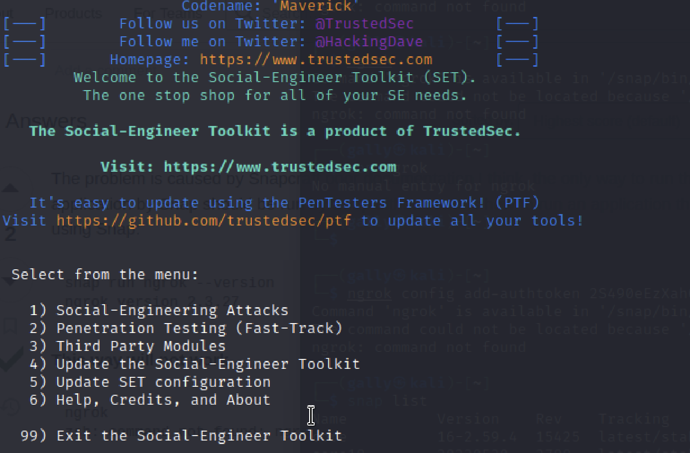
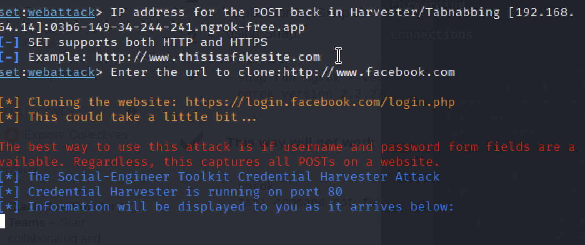
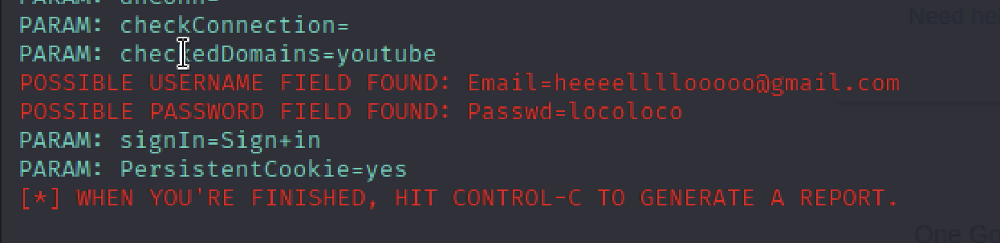

# Let's go Phishing

    Mode : Solo
    Duration : 4 days
    
## Challenge

  Bob has a dog (a bull terrier) named "Shimi". Bob really loves his dog.
  Alice is a fan of Mécanique. She has two vintage cars and often likes to parade around with her ancestral objects.
Your mission will be to obtain Alice's or Bob's password

## Phishing Project

Engaging Social Media Presence: Establish an active presence on social media platforms such as Instagram, Facebook, and Twitter. Share high-quality photos and videos of Bull Terriers in various settings, showcasing their personality and charm. Encourage followers to share their own Bull Terrier stories and images, fostering a sense of community.

## Newsletter template

# Installation Ngrok

I created an account

Installing Ngrok via Snap

	snap install ngrok
	
	snap run ngrok config add-authtoken *********   

## Setoolkit

I read this article to have a little idea how it works [Phishing Attack](https://www.cybervie.com/blog/phishing-attack-using-kali-linux/)

Gathered a few information about the setoolkit.

	Option 1) Social-Engineering Attacks
	Option 2) Website attack vectors
	Option 3) Credential Harvester Attack Method
	Option 2) Site cloner 
	
## Ngrok configuration
	
	snap run ngrok http 80	
	
Connecting Ngrok forwarding with setoolkit

	copy the forwarding into my setoolkit 
	

##Install Sendmail

apt-get install sendmail

